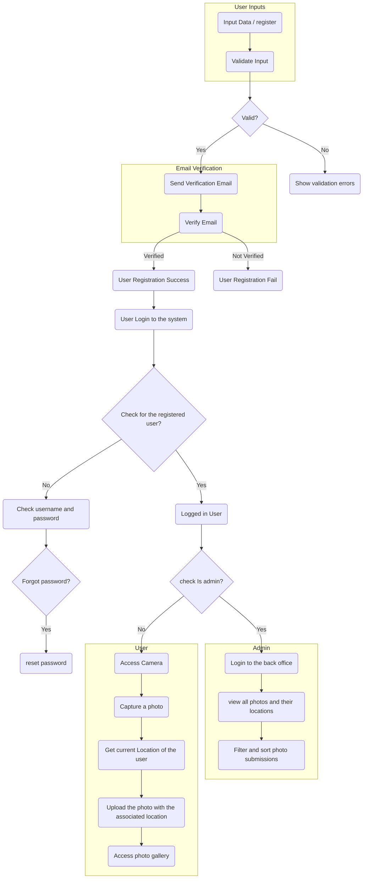

Flow Chart for this Project:

```mermaid
graph TD;
    subgraph User Inputs
        A(Input Data / register)
        B(Validate Input)
    end
    subgraph Admin
        T(Login to the back office)
        U(view all photos and their locations)
        V(Filter and sort photo submissions)
    end
    subgraph User
    O(Access Camera)
    P(Capture a photo)
    Q(Get current Location of the user)
    R(Upload the photo with the associated location)
    S(Access photo gallery)  
   end
    subgraph Email Verification
        D(Send Verification Email)
        E(Verify Email)
    end

    A --> B --> C{Valid?}
    C -- Yes --> D
    C -- No --> AB(Show validation errors)
    D --> E
    E -- Verified --> F(User Registration Success )
    E -- Not Verified --> G(User Registration Fail)
    F --> H(User Login to the system)
    H  ---> I{Check for the registered user?}
    I -- No --> J(Check username and password) 
    J --> K{Forgot password?}
    K --Yes--> L(reset password)
    I -- Yes --> M(Logged in User)
    M --> N{check Is admin?}
    N -- No --> O
    O --> P
    P --> Q
    Q --> R
    R --> S      
    N -- Yes --> T
    T --> U
    U --> V
```
